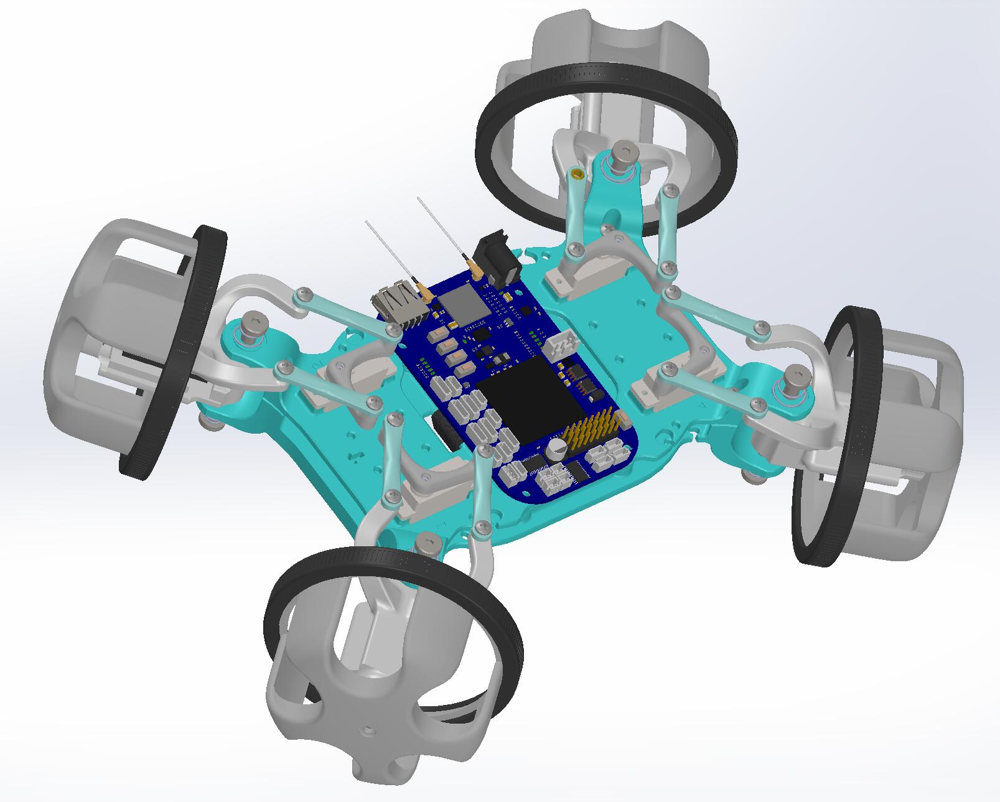

# BeagleBone project--EduRover(version2)

### Project Description:

This is an application of the embedded system: Beaglebone. EduRover is originally designed by James Strawson(jstrawso@eng.ucsd.edu) in the Done Lab and Coordinated Robotics Lab, UCSD. In version 2, we made some modification on it, redesigned some part of it. In our case, high torque motors could be perfectly embedded into our design and with the higher level control algorithm, we can manually drive EduRover in different modes. Meanwhile, with the high torque motors, we can balance EduRover by using only two wheels when it faces the wall.      

### Team Member:

Zhaoliang Zheng (zhz503@eng.ucsd.edu)

Dominique E. Meyer (demeyer@ucsd.edu)

Neal Bansal (nkbansal@ucsd.edu)

Pengcheng Cao (p5cao@eng.ucsd.edu)

Junchao Lin (jul025@eng.ucsd.edu)

### EduRover V2:

